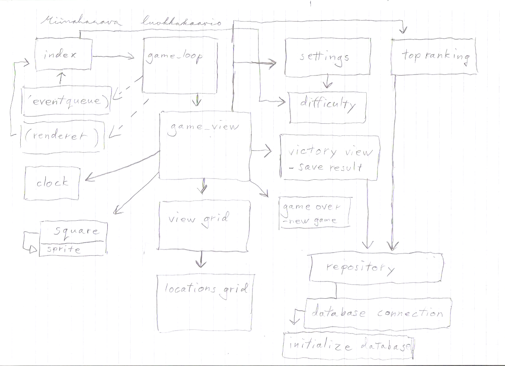

# Arkkitehtuuri

### Luokkakaavio: 

 
### Hakemistorakenne
Tällä hetkellä olen ottanut hakemistorakenteeseen mallia sekä Sokoban että ToDo-referenssisovelluksista. Tiedostojen nimeämisessä ja luokkien jaottelussa olen käyttänyt Sokobania apuna, mutta koska siinä sovelluksessa useat tiedostoista/luokista on suoraan src-hakemissa, olen koittanut jaotella tiedostoja toiminta/vastuu-alueensa mukaan hieman eri kansioihin, joiden nimeämisessä ja jaottelussa olen käyttänyt ToDo-sovellusta esimerkkinä. Testit laitan omaan "tests"-hakemistossa ja sprite-kuvat "assets"-hakemistossa. Luokat joiden vastuualue on keskittynyt käyttöliittymään ovat "ui"-hakemistossa ja "services"-hakemistossa on taas luokat, jotka vastaavat pääasiassa sovelluksen toiminnallisuuksista. Lisäksi on "repositories"-kansio, jonne ajattelin sijoittaa tietokantoja käsittelevän "repository"-tiedoston/luokan, kun pääsen siihen asti sovelluksen tekemisessä. Muuten ohjelmakoodi on toistaiseksi sijoitettu "src"-kansioon.
