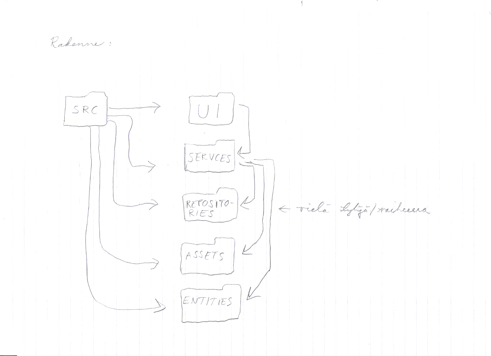

# Arkkitehtuuri

### Hakemistorakenne

Tällä hetkellä olen ottanut hakemistorakenteeseen mallia sekä Sokoban että ToDo-referenssisovelluksista. Tiedostojen nimeämisessä ja luokkien jaottelussa olen käyttänyt Sokobania apuna, mutta koska siinä sovelluksessa useat tiedostoista/luokista on suoraan src-hakemistossa, olen koittanut jaotella tiedostoja toiminta/vastuu-alueidensa mukaan hieman eri kansioihin, joiden nimeämisessä ja jaottelussa olen käyttänyt ToDo-referenssisovellusta esimerkkinä. Luokat joiden vastuualue on keskittynyt käyttöliittymään ovat "ui"-hakemistossa ja "services"-hakemistossa on taas luokat, jotka vastaavat pääasiassa sovelluksen toiminnallisuuksista. Lisäksi on "repositories"-kansio, jonne ajattelin sijoittaa tietokantakomentoja käsittelevän "repository"-tiedoston/luokan, joka on vielä työn alla.  Vaikeustasoa, sprite-kuvaolioita ja pelikelloa kuvaavat ovat "entities"-hakemistossa. Varsinaiset sprite-kuvien png-kuvatiedostot ovat "assets"-hakemistossa. Muu ohjelmakoodi, kuten pelin käynnistävä index-tiedosto ja tietokantyhteyden luontiin liittyvät tiedostot ovat src-hakemiston juuressa.

### Luokkakaavio: 
Alustava versio:

### Sekvenssikaavio
Sekvenssikaavio kuvaa ohjelman käynnistymisen alkua ja on kahdessa osassa luokkien suuren määrän vuoksi.

