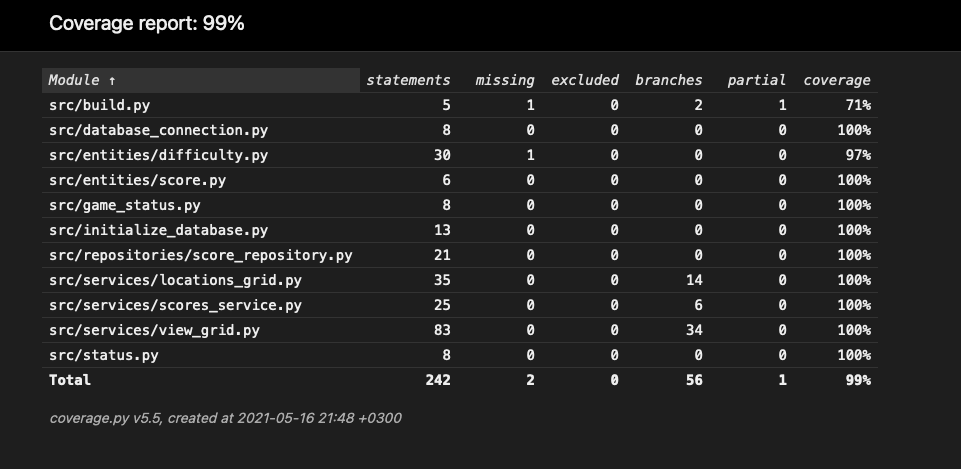

# Testausdokumentti

Ohjelmaa on testattu sekä Pytestin avulla, että käytännön toiminnassa. Pytest-testit ovat kattaneet lähinnä sovelluslogiikkaa ja tietokantayhteyden toimivuutta. Käyttöliittymän testaus on tapahtunut käytännön kokeilun kautta.

## Pytest

Koska ohjelmani sovelluslogiikan kaksi luokkaa, ViewGrid ja LocationsGrid, toimivat niin tiiviisti yhdessä, päätin kokeilla molempien luokkien toimivuutta view_grid_test.py-tiedoston kautta. ViewGrid luo oman LocationsGrid-luokan, jota se käyttää toimiakseen, LocationsGridin toimivuus tuli käsiteltyä samasta testiluokasta käsin. Nämä luokat hyödynsivät tiiviisti myös ohjelman vaikeustasosta vastaavaa Difficulty-luokkaa, joten tämänkin luoka pääsi tätä kautta testikattavuuden piiriin.

Toinen testiluokkani TestScoresService testasi ScoresService-luokkaa, joka ohjelmassani käsittelee SQL-tietokannasta saatavia tietoja ja sitä kautta tietokantayhteyden toimivuutta. Näin myös tämä luokka tuli testanneeksi repositories-kansion ScoreRepository-luokkaa, jonka vastuualueena on varsinaiset tietokantakomennot.

Testikattavuusraporttini näyttää seuraavalta:

